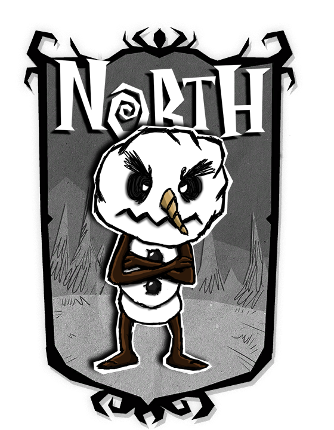
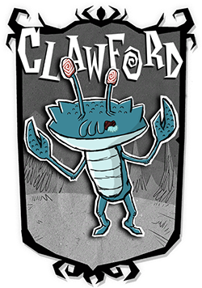
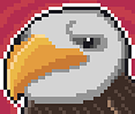

# Personal portfolio by Jesse Nukarinen 
This portfolio includes personal and school related projects. A separate category is for separate projects.

## Personal Projects

### Character Mods for the game Don't Starve Together
I have made Two LUA based character mods for the game Don’t Starve Together,
published to Steam Workshop. 
The characters were made using LUA, modifying already found files in the game files, writing new code and drawing new graphics.
- ### [North the Snowman](https://steamcommunity.com/sharedfiles/filedetails/?id=583735156)

- ### [Clawford the Crab](https://steamcommunity.com/sharedfiles/filedetails/?id=1276022780)

### Character Mod for the game Blazing Beaks
I have made a character mod for the game Blazing Beaks. The character includes new unique sprites for each animation, new sound effects and statistics for the character modified with game balance in mind.
### [The Eagle](https://steamcommunity.com/sharedfiles/filedetails/?id=1743903650)

### Aalto Games Now - Game Jam 2019 Game - BioTrio
I attended Aalto University's 2019 Games Now course Game Jam, which lasted 3 days.

[Here is the link to the game submission.](https://itch.io/jam/gnjam19/rate/421844)  
The game was built in Unity and programmed with C#.

My responsibilities included the 2D art and animations for the characters and programming some parts of the game, like the weapon mechanics and some enemy mechanics, as well as various smaller fixes and additions.

Here is a screenshot from the game:

## School Projects

### Online Game Store
[This website](http://gamestore-torque.herokuapp.com/store/index) is an online game store made for Aalto University Web Software Development course. It was done in a group of three. In this project my responsibilities were:

- Login Authorization and User Registration using Django Auth (Created User app for all auth features)
- "Forgotten Password" - feature, Email account confirmation, Email change confirmation email (Using Console Backend)
- Profile (Password change, Profile Edit, Avatar change/add)
- Final Site Styling (Logo, Color scheme, Fonts) 
- Images on site (Default profile picture, Front page banner and Forestrunner ad, Torque logo, default game picture) 
- 3rd Party Login (Facebook) using Django allauth 
- Own Javascript game, “Forestrunner”, [which is playable here](http://gamestore-torque.herokuapp.com/store/coolgame)
- Custom error pages
- Front-end (CSS, Bootstrap) for (Login/Registration, Profile, Registration, Nav-bar ) 

### Responsive Website Project
This [website](https://jesnuka.github.io/Responsive-website/) was done as a project for Responsive Web Design course at VIA University College, Aarhus,

Denmark together with Julia Korhonen. It includes responsive design and works in multiple resolutions, including mobile.

### Text Adventure Game

[The Curse of Adbury - Scala text adventure game](https://github.com/jesnuka/Curse-of-Adbury-text-adventure-game) for Aalto University course. Includes multiple different endings, many different commands and hidden features. Made together with Veikka Halonen.

### Flappy World game
Very simple [Scala game](https://github.com/jesnuka/Flappy-World-game) for a Aalto University course.
